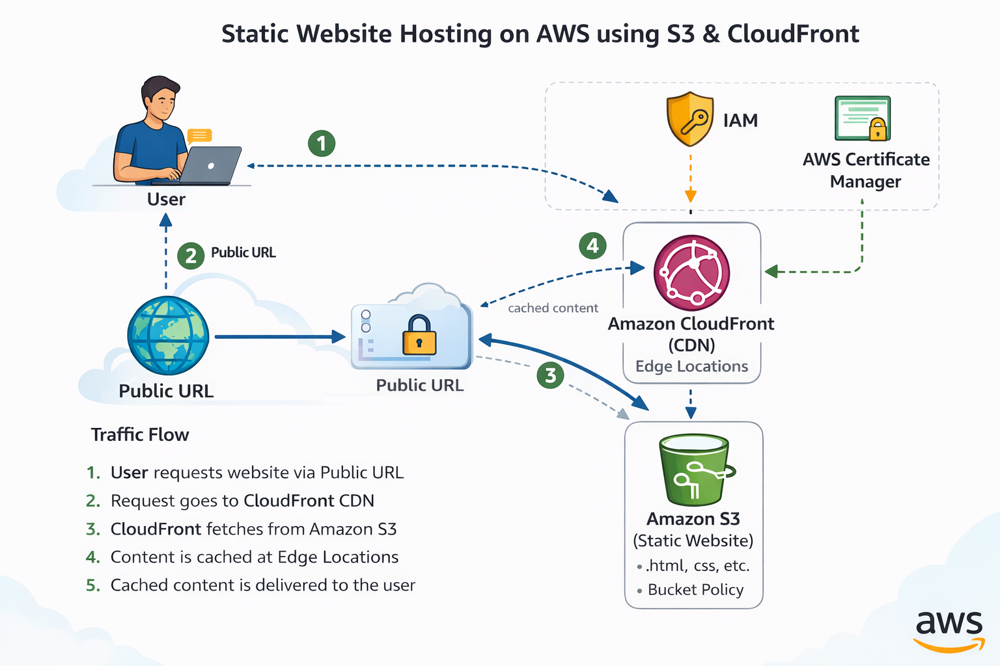

# aws-static-website-s3-cloudfront
Static website hosting on AWS using Amazon S3 and CloudFront CDN

**Project Overview:**

- This project demonstrates how to host a secure, highly available, and globally accessible static website on Amazon Web Services (AWS) using Amazon S3 and Amazon CloudFront.

- The goal of this project is to understand how static websites are delivered at scale using object storage and Content Delivery Networks (CDN), following AWS best practices for performance, security, and cost efficiency.
  

**Architecture Overview:**

**Traffic Flow:**

1. User accesses the website using a public URL
2. Request reaches Amazon CloudFront (CDN)
3. CloudFront fetches content from Amazon S3 bucket
4. Content is cached at edge locations
5. Response is delivered to the user with low latency

**AWS Services Used:**

- Amazon S3
- Amazon CloudFront
- AWS Certificate Manager (ACM)
- IAM
- S3 Bucket Policies

**Step-by-Step Implementation:**

**Step 1: Create an S3 Bucket**

Created an Amazon S3 bucket to store static website files.

Uploaded HTML, CSS, and other static assets.

 **Purpose:**
Amazon S3 provides durable and cost-effective object storage.

**Step 2: Configure Static Website Hosting:**

Enabled static website hosting on the S3 bucket.

Configured index and error documents.

**Purpose:**
Allows S3 to serve website content directly.

**Step 3: Secure S3 Bucket Access**

Disabled public access to the S3 bucket.

Configured bucket policies to allow access only from CloudFront.

**Security Principle:**
Prevent direct public access to S3 content.

**Step 4: Create CloudFront Distribution**

Created a CloudFront distribution with S3 as the origin.

Enabled caching for faster content delivery.

**Purpose:**
Improves performance by serving content from edge locations.

**Step 5: Enable HTTPS using ACM**

Generated SSL/TLS certificate using AWS Certificate Manager.

Configured CloudFront to serve content over HTTPS.

**Purpose:**
Ensures secure communication between users and the website.

**Step 6: Test and Validate**

Accessed the website using the CloudFront domain name.

Verified content delivery, caching behavior, and HTTPS support.

**Security Best Practices Implemented:**

- Public access blocked at S3 bucket level
- Access restricted using S3 bucket policies
- HTTPS enabled via CloudFront and ACM
- No credentials stored in code

**Key Learnings:**

- Hosting static websites on Amazon S3
- Using CloudFront as a Content Delivery Network
- Improving performance using edge caching
- Securing content with HTTPS and bucket policies

**Notes:**

- This project was implemented as a hands-on learning exercise.
- No sensitive data or credentials are included in this repository.
